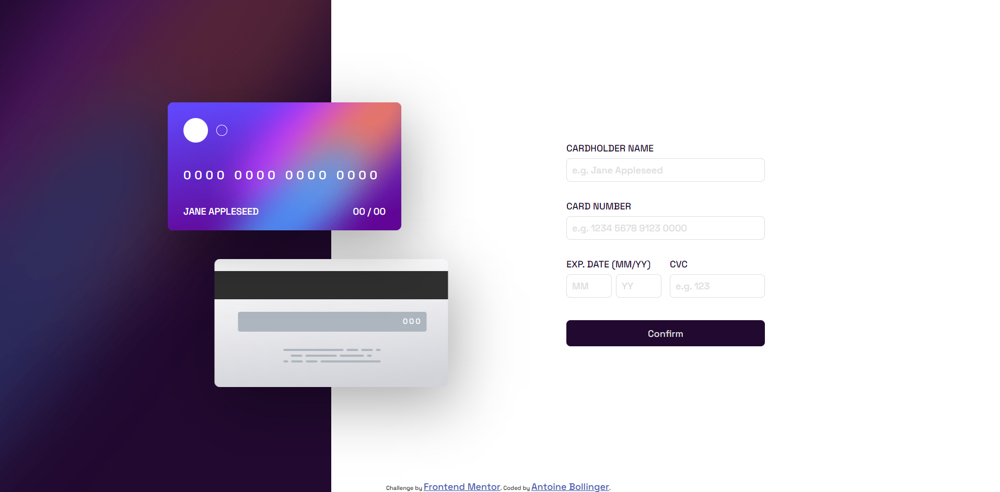

# Frontend Mentor - Interactive card details form solution

This is a solution to the [Interactive card details form challenge on Frontend Mentor](https://www.frontendmentor.io/challenges/interactive-card-details-form-XpS8cKZDWw). Frontend Mentor challenges help you improve your coding skills by building realistic projects. 

## Table of contents

- [Overview](#overview)
  - [The challenge](#the-challenge)
  - [Screenshot](#screenshot)
  - [Links](#links)
- [My process](#my-process)
  - [Built with](#built-with)
  - [What I learned](#what-i-learned)
- [Author](#author)

## Overview

### The challenge

Users should be able to:

- Fill in the form and see the card details update in real-time
- Receive error messages when the form is submitted if:
  - Any input field is empty
  - The card number, expiry date, or CVC fields are in the wrong format
- View the optimal layout depending on their device's screen size
- See hover, active, and focus states for interactive elements on the page

### Screenshot



### Links

- Solution URL: [on Github](https://github.com/antoinebollinger/interactive-card-details-form.git)
- Live Site URL: [on Netlify](https://benevolent-bavarois-29aafc.netlify.app/)

## My process

### Built with

- Semantic HTML5 markup
- CSS custom properties
- SCSS for managing the CSS code
- Flexbox
- Vanilla Javascript

### What I learned

I've created a function that formate the card number:

```js
  #formatNumber() {
    this.#form.elements['card-number'].addEventListener('keyup', (e) => {
      const formatedValue = [...e.target.value].filter(ele => ele !== ' ').map((ele, index) => {
        return `${(index % 4 === 0 ? ' ' : '')}${ele}`
      }).join('');
      e.target.value = formatedValue;
    })
  }
```

## Author

- Website - [antoinebollinger.fr](https://antoinebollinger.fr)
- Frontend Mentor - [@antoinebollinger](https://www.frontendmentor.io/profile/antoinebollinger)
- Github - [@antoinebollinger](https://github.com/antoinebollinger)